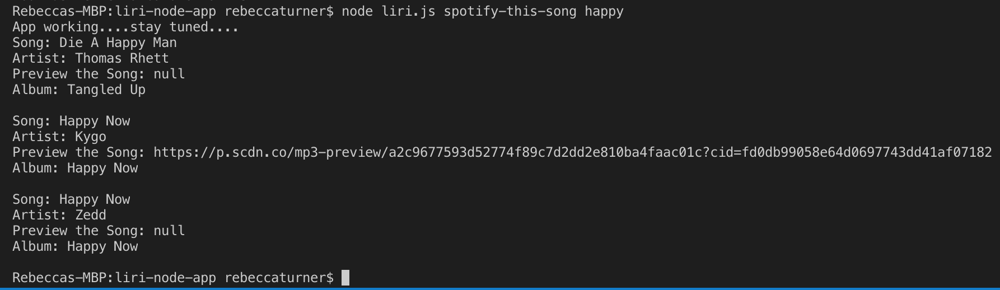

# liri-node-app

##LIRI is a Language Interpretation and Recognition Interface. It's command line node app that takes in one of four parameters and returns the relative data:

* "concert-this" asks the user to input a band or artist and hits the Bands In Town API to return the concert venues where this artist is playing
* "spotify-this-song" asks the user to input a song. It hits the spotify API and returns info about the song
* "movie-this" asks user to input a movie. It hits the OMDB API and returns info about the movie
* "do-what-it-says" reaches into the random.txt file and inputs the commands listed

!(images/concert-this-input.png)
After inputing the command "concert-this" "<artist>"

!(images/concert-this-no-input.png)
After inputing the command "concert-this" with no input

!(images/movie-this-input.png)
After inputing the command "movie-this" "<movie>"

!(images/movie-this-no-input.png)
After inputing the command "movie-this" with no input

After inputing the command "spotify-this-song" "<song>"

!(images/spotify-this-no-input.png)
After inputing the command "spotify-this-song" with no input

!(images/do-what-it-says.png)
After inputing the command "do-what-it-says" 

