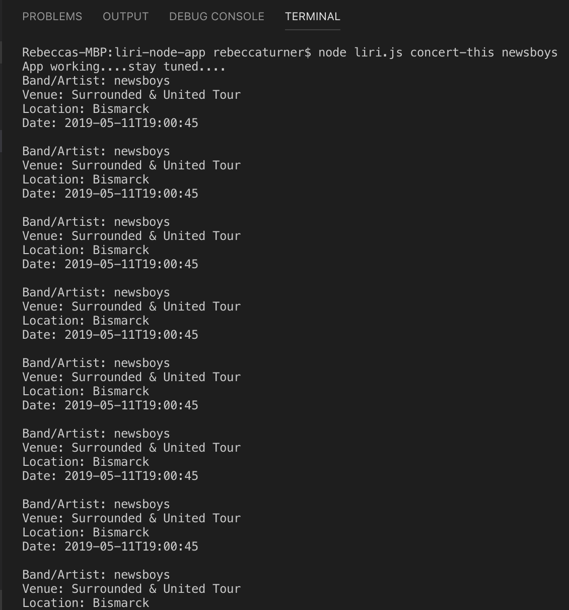

# liri-node-app

##LIRI is a Language Interpretation and Recognition Interface. It's command line node app that takes in one of four parameters and returns the relative data:

* "concert-this" asks the user to input a band or artist and hits the Bands In Town API to return the concert venues where this artist is playing
* "spotify-this-song" asks the user to input a song. It hits the spotify API and returns info about the song
* "movie-this" asks user to input a movie. It hits the OMDB API and returns info about the movie
* "do-what-it-says" reaches into the random.txt file and inputs the commands listed

Format: 
After inputing the command "concert-this" "<"artist">"

